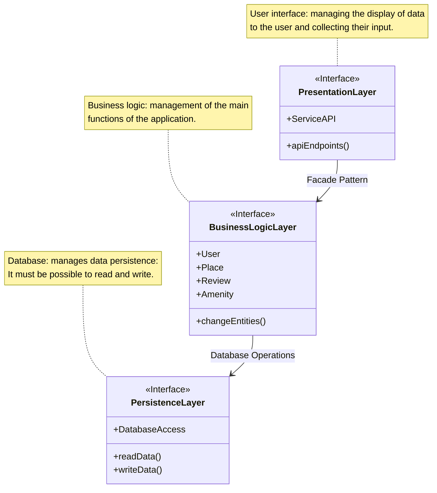

```mermaid
classDiagram

direction TB

class PresentationLayer {

+ServiceAPI

+apiEndpoints()

}

  

class BusinessLogicLayer {

+User

+Place

+Review

+Amenity

+changeEntities()

}

  

class PersistenceLayer {

+DatabaseAccess

+readData()

+writeData()

}

  

<<Interface>> PresentationLayer

  

note for PresentationLayer "User interface: managing the display of data </br> to the user and collecting their input."

  

<<Interface>> BusinessLogicLayer

  

note for BusinessLogicLayer "Business logic: management of the main </br> functions of the application."

  

<<Interface>> PersistenceLayer

  

note for PersistenceLayer "Database: manages data persistence:</br> It must be possible to read and write."

  

PresentationLayer --> BusinessLogicLayer : Facade Pattern

BusinessLogicLayer --> PersistenceLayer : Database Operations
```
